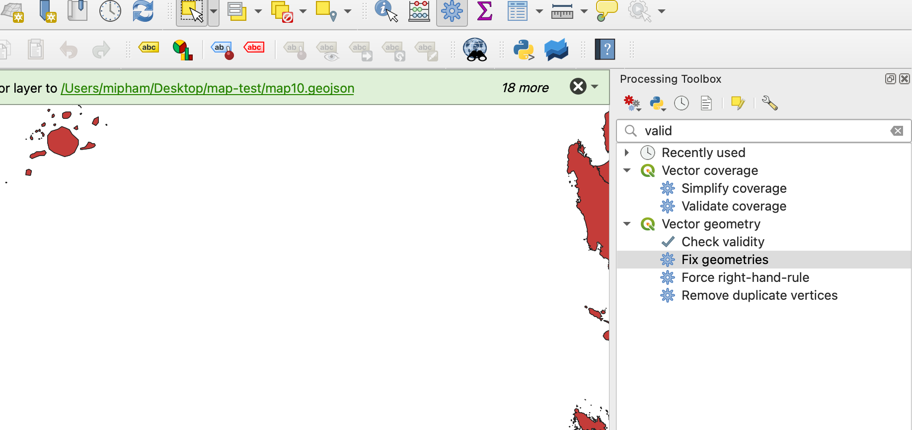
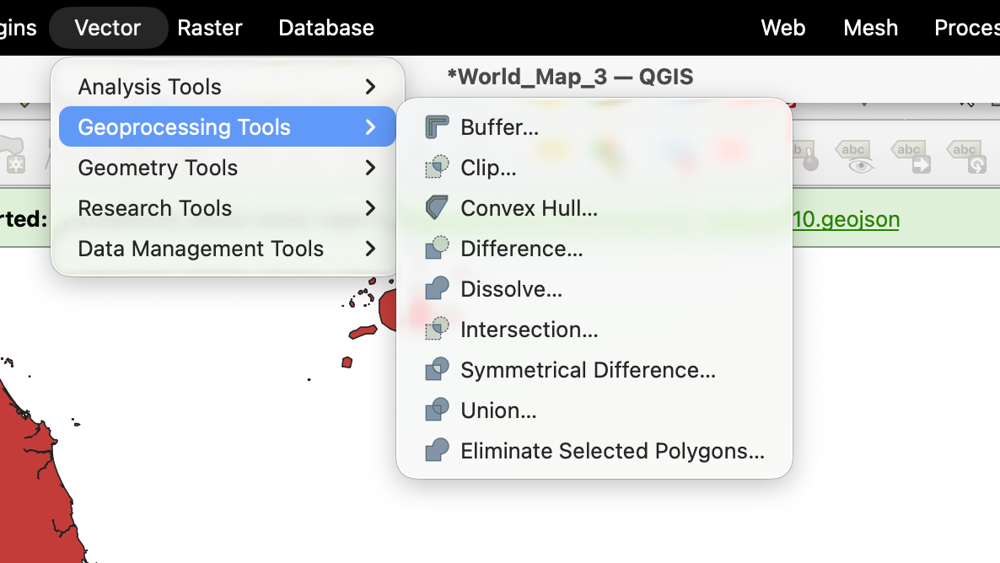
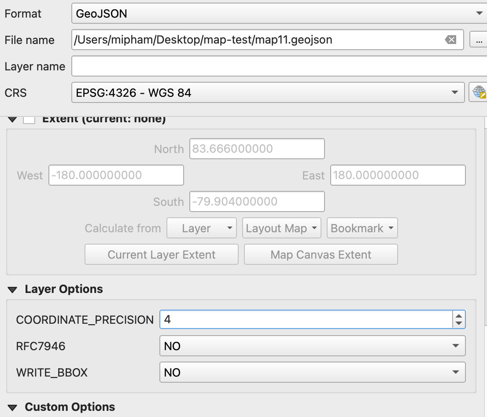
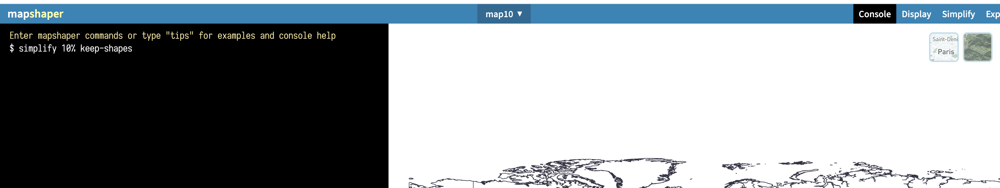

# Base Map Preparation for Highcharts

## Overview

This guide describes the process of converting shapefiles into optimized TopoJSON format for use with Highcharts Maps.

## Processing Workflow

### 1. Fix Geometry

- Open the shapefile and fix any geometry errors
- Ensures clean data for proper rendering
  

### 2. Dissolve

- Perform dissolve operation to merge polygons
- Simplifies boundaries and reduces complexity
  

### 3. Export to GeoJSON

- Export to GeoJSON format
- Configuration: **3-4 decimal places** (recommended for web maps)
  

### 4. Convert to TopoJSON

- Go to [mapshaper.org](https://mapshaper.org/)
- Import the exported GeoJSON file
- TopoJSON is Highcharts' preferred format for better performance

### 5. Simplify and Optimize

- Open Console in mapshaper
- Run simplify command with parameters:
  - Simplify: **10%**
  - Option: **`keep-shapes`**
- This reduces file size while maintaining visual quality
  

### 6. Export TopoJSON

- Export the final file in TopoJSON format
- Ready to use with Highcharts Maps

## Tools Used

- **QGIS/ArcGIS** - Shapefile processing and geometry fixes
- **[Mapshaper](https://mapshaper.org/)** - GeoJSON to TopoJSON conversion and optimization

## Integration with Highcharts

Once exported, the TopoJSON file can be used with Highcharts Maps:

```javascript
Highcharts.mapChart("container", {
  chart: {
    map: "path/to/your-map.topojson",
  },
  // ... other options
});
```

link: https://raw.githubusercontent.com/HuynhMi/map-test/main/map10.json

## Notes

- **3-4 decimal places** balances precision with file size for web performance
- **10% simplification** typically provides good visual quality with significant size reduction
- **`keep-shapes`** prevents loss of small but important geographic features
- TopoJSON format is more efficient than GeoJSON for Highcharts (shared topology, smaller files)
